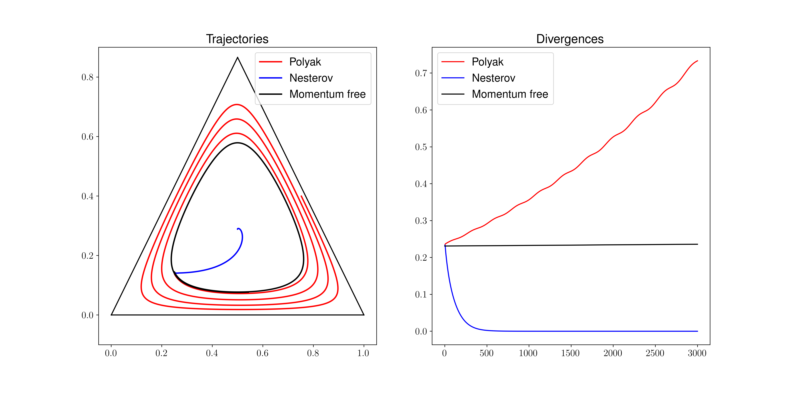
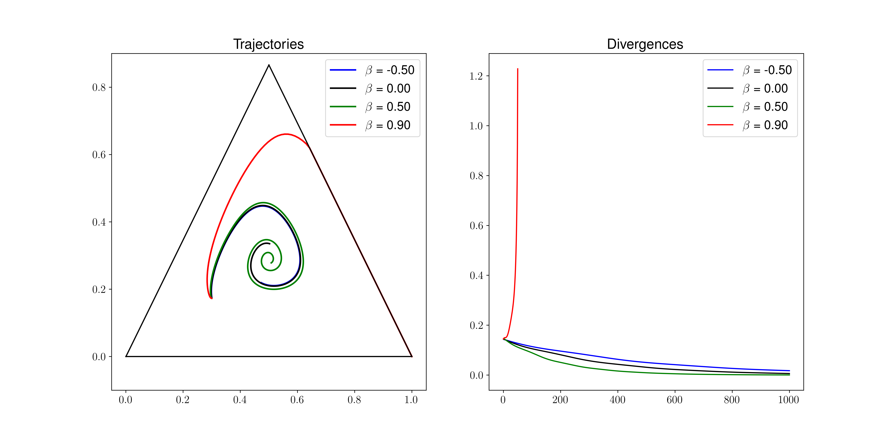
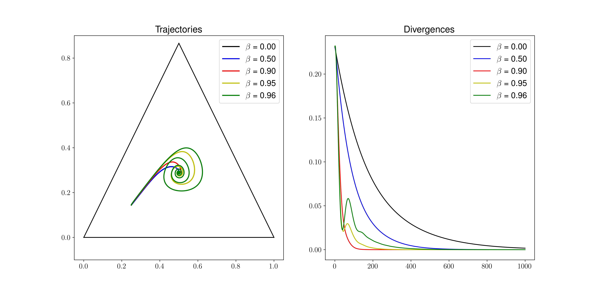
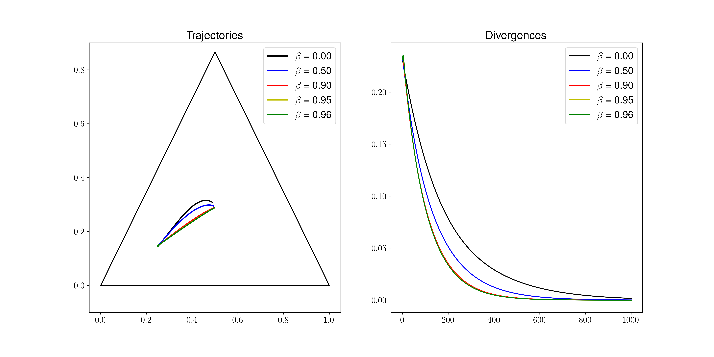

# pyed

pyed is a python package to compute trajectories of evolutionary dynamics
on Riemannian geometries and with momentum. For example, the library can be used to generate
phase portraits of discrete replicator equations with various parameters, and generalizations.

## Examples

The tests and [examples.py](examples.py) file contain several examples. There is also a
[jupyter notebook](https://github.com/marcharper/pyed/blob/notebooks/Momentum%20Paper%20Figures.ipynb)
that produces several example trajectories:

<div style="text-align:center">

<br/>

<br/>

<br/>

<br/>
</div>

## Tests

This repository uses `pytest`. You can run the tests from the command line with
```
pytest
```

in the root level directory of the repository.


# Repository history
This repository was originally named metric-incentive-dynamics and located at
https://github.com/marcharper/metric-incentive-dynamics
containing code to compute plots for a publication. See the [archived readme](archive/README.md)
for more information. The code was extended to support momentum and made into an installable
python package in the current repository.


